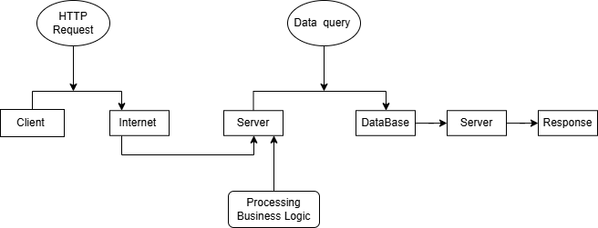

# Day 1 - Internet & Client-Server Architecture

## Learning Objectives
Today I learned the basics of how the Internet works and how websites and web application communicate using the Client-Server Architecture.
---
# 1. Internet

## Definition 
The Internet is a global network of interconnected computer networks that allows devices to connect with each other exchange data 
No Internet >> no Exchange of data 

## WHy does it exist 
It allows people and systems overall to share information, communicate, and access online services

## Network of Networks 
It is called so cause it connects million of smaller networks( home, office, uni, company) into one global network 

## Example 
When I search anything on browser like google, it sends request through Internet to Google's server and receives response from the server to browser through the same internet 

# 2. Website 

## Definition  
A website is collection of webpages that are stored on the server and can be accessed through the internet using the web browser 

### Examples 
Google, github, Amazon, youtube

## Type >> Static and Dynamic Website 

### Static Website 
- Same content for each user 
- Does not change frequently 
- Mostly information purpose like portfolio 

### Dynamic Website 
- It change i.e. content according to the use of the user 
- Uses database and server side processing 
- Like amazon >> adding item in cart, payment, etc

# 3. Web Application 
It is software that runs on web browser and allows user to perform tasks.

## Difference from Website 
A website mainly provides information, while a web application allows users to interact and perform defined actions

## Conclusion 
Every web application is accessed through a website, but not every website is a web application.

# 4. Client

## Definition 
A client is a way that sends request to a server.
Web Browser, Mobile app, Postman, Playwright  

**The client always initiates communication.**

# 5. Server 
## Definition
It is a computer or software that receives client request, processes them and sends back responses

### Server Responsibilities 
- Receive REquest 
- Process REquest 
- Access Database if required 
- Send Response 

## Examples
- GMail Server
- Amazon Server 
- Airline Booking Server

## Client–Server Architecture Diagram

# 6. FrontEnd

## Definition 
The frontend is the part of the software or app which user can see and interact with, runs on client

## Technologies used 
- HTML >> Structure
- CSS >> Styling 
- JavaScript >> Functionality( Interactivity)

## Runs In 
Web Browser 

**Everything the user sees belongs to the Frontend**

# 7. BackEnd 

## Definition  
It is the part where the application processes request, manage data, runs on server

### Responsibilities
- Business Logic 
- Database
- Authentication
- API

**Everything the user does not directly see belongs to the backend**

# 8. Request and Response 

## Request and Response LifeCycle 

Browser - > internet -> Server -> Database -> Server -> Browser 

### Request
The Browser >> client sends a request to the server asking for information or a service 

### Processing 
The server processes the request, perform necessary business logic and retrieve data from database if required any and prepare the response 

### Response 
The server sends the requested data back to the browser, which displays it to the user.

# **QA perspective**

Understanding Client–Server Architecture helps a QA Engineer identify where defects originate and communicate them effectively with developers.

## Frontend Testing

A QA Engineer verifies:
- UI layout and responsiveness
- Buttons, forms, and navigation
- Input validation
- Error messages
- Cross-browser compatibility
- User experience

### Example Frontend Bugs
- Login button is not clickable.
- Text overlaps on mobile devices.
- CSS is broken.
- Incorrect font or color.
- Page does not render properly.

---

## Backend Testing

A QA Engineer verifies:
- Business logic
- API responses
- Database updates
- Authentication and authorization
- Data consistency
- Server-side validations

### Example Backend Bugs
- Incorrect fare calculation.
- Wrong user data returned.
- Booking created twice.
- API returns HTTP 500.
- Database is not updated after payment.

---

## Client Server Understanding in QA

When a defect is reported, the first step is to identify where the issue originates.

## Key Takeaway

A good QA Engineer doesn't just find bugs they understand where the bug is likely occurring and provide developers with enough information to reproduce and fix it quickly.